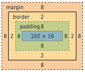

# Class5 - CSS, Development Style and Grace

## Project File Organization

## Separation of Concerns


## App file structure/hierarchy

- **/models** - contains ORM models (mongoose `Schemas`)
- **/views** - view-templates
- **/public** - all static content
  - **/images**
  - **/stylesheets**
  - **/javascripts**
- **/routes** - all express routes, separated by app module/area
- **/tests** - for unit-tests
- **/node_modules** - created by `npm`

## CSS

Open up [Codepen](http://codepen.io/pen/), we're going to learn CSS!

CSS (cascading style sheets) is the language that makes the web pretty. It lets us describe the **look and formatting** of HTML elements. In this way, it *separates the concern* of the style of the page from all other aspects of a web app. In the early days of the web, HTML was also responsible for this, but all HTML formatting and style directives are now deprecated in favor of CSS.

Every HTML element can be styled by CSS. Elements can be styled by tag name, class, id, and more. Below is an example of basic CSS syntax:

```css
selector {
  property: value;
  property: value;
  ...
}
```

Properties can be named in any order, but in the case of directly conflicting properties, the last one defined will apply. Many property names are fairly self-explanatory, but the [full property table](http://www.w3.org/TR/CSS21/propidx.html) may serve as a useful reference. Or Google.

### Units

Many properties values are lengths, which can be specified in many different ways in CSS. The units below are the most common.

| Unit  | Description |
|----|----|
| `px` | Usually a single pixel on the client's screen (a line of width `1px` is guaranteed to be "sharp and visible")
| `em` | Relative to the font-size of the element (`0.5em` is half of the current font-size)
| `%` | Percent of the parent element along the relevant dimension (horizontally or vertically)

CSS also supports the absolute units `cm`, `mm`, `in`, `pt`, and `pc`, but these are better suited for print than the screen.

### Selectors and Specificity

The most common selector is a `tagname`, a `class` (preceded by `.`), or an `id` (preceded by `#`), though there are many other ways to select elements to style.

Styles of elements _cascade_ (apply) to their child elements. In cases where multiple conflicting styles are applied to an element, _the more specific style prevails_.

So with this document:

```css
<div class="styled">Content</div>
```

and this style:

```css
div {
  color white;
  background-color: red;
}

.styled {
  background-color: blue;
}
```

The single `div` in the document will have a blue background color because the selector `.styled` is more specific than `div`. Paste the above into [Codepen](http://codepen.io/pen/) to test it out.

### Colors

A quick aside on colors, which can be specified in CSS in multiple ways.

| Method | Description |
|----|----
| `#RRGGBB` | Red, green, and blue are each specified by a two-digit hex number, `00` to `FF`. White is `#FFFFFF` and black is `#000000`.
| `#RGB` | Same as above but with half the precision.
| `name` | Certain colors (like red, blue, yellow, etc.) can be specified simply by name. They're mostly hideous but black and white are fine.
| `rgb(r,g,b)` | Red, green, and blue are specified on a 0-255 scale.
| `rgba(r,g,b,a)` | Same as above, but alpha (opacity) is specified on a 0-1 scale.

Here's a neat [clock](http://whatcolourisit.scn9a.org) that displays the color specified by the hex code corresponding to the current time.

### Box Model

All HTML elements can be modeled as boxes. CSS allows us to modify that box to affect the display of content. Below is the styling for a box and its corresponding box model. The properties under `/* metrics */` determine the size of the box and the spacing of its contents.

```css
.styled {
  background-color: blue;
  color: white;
  text-align: center;

  /* metrics */
  margin: 8px;
  border: 2px dotted black;
  padding: 8px;
  width: 100px;
}
```



In the image above, the solid border around the yellow box defines the outer edge of the element. The `margin` is space between the box and its surroundings. The `border` is space between the outer edge and the `padding`, which defines the space between the inner edge of the border and the content of the element.

As the image above shows, the `width` property sets the width of the *content*, not the width of the entire element. This means that `padding` and `border` add to the apparent dimensions of the box. We can add the below property to change that:

```css
box-sizing: border-box;
```

With this property set, the `width` and `height` properties set the dimensions of the box, and those dimensions are not affected by `padding` or `border`.

Try playing with these properties in Codepen to see the effect of `box-sizing: border-box`.

###