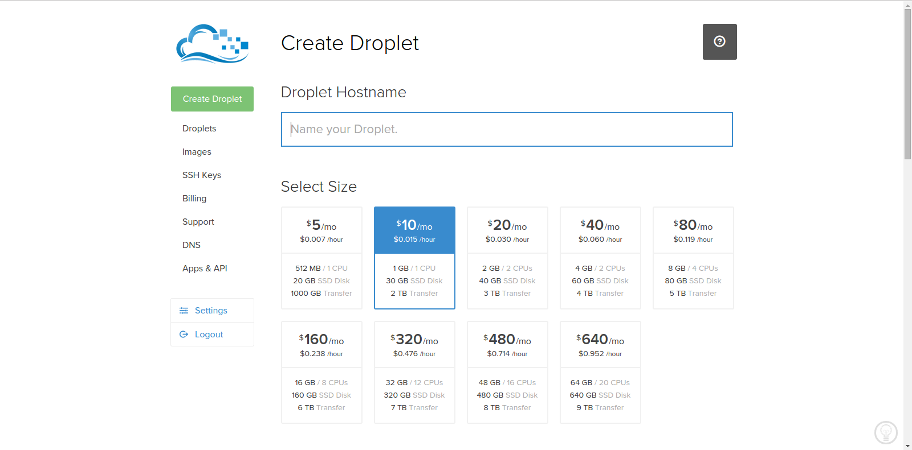
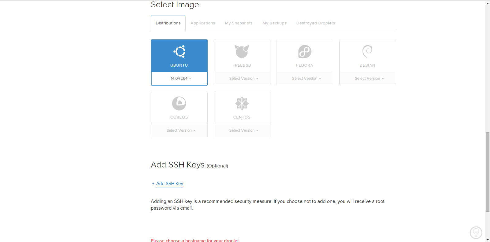
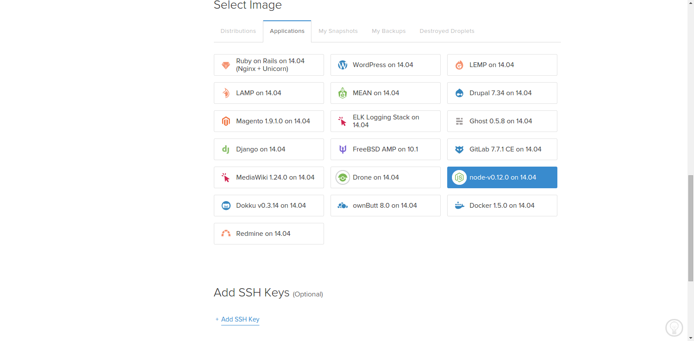

#Class 12

##How to Digital Ocean
###A short guide on how/why to spin up a Digital Ocean Droplet

First, go to this link [education.github.com/pack](https://education.github.com/pack) and sign up.
This automatically gives you a ton of student tools/perks, along with $100 of free credits for Digital Ocean, meaning you probably will never need to spend money to host a server!

Now, into the actual nitty-gritty. To start off with, how about some basic terminology?
First, *Droplet* refers to a small cloud instance server, mainly used within Digital Ocean.
Second, *SSH* stands for secure shell, an encrypted method of connecting to and manipulating your server.
This equates to a terminal session.
If in Windows, you will need a third-party program ([PuTTy](http://www.chiark.greenend.org.uk/~sgtatham/putty/) is the most common), but in UNIX-based systesm all you need to do is `ssh user@serverip:port`.

###The what:
Digital Ocean is a service where you can spin up a droplet quickly, use it as a highly customizable linux server, then stop the droplet and not spend a small fortune on it all.
The service itself is more hands on, meaning you have to understand a bit about connecting remotely to a server.
While heroku is nice for quickly building an app/webpage, droplets let you actually control every aspect of the OS and applications.
The best feature (in my mind) is that it's a full time server, and will not slowdown if not used after a certain amount of time.
This means that if you access the server in 5 minutes or 5 years, it will respond quickly.

###The why:
####Pros:

- Fast startup/creation
- Very customizable
- Super cheap for a low power server
- Working in UNIX (you already know this stuff!)
- Accessible easily through SSH (host OS doesn't really matter)
- Very little downtime for your server

####Cons:
- A lot more hands on, you actually have to take care of it
- If things break, you have to figure out why
- Takes more inital work, but usually lasts longer
- Money - free is still free, and pretty hard to beat
- OS customization - you can't choose any OS you want, only one from pre-built images provided by Digital Ocean

###The how:
So now to actually setting up your own droplet.
Since this is a tutorial, we'll go through setting one up, taking an image of it, and then deleting it. Because of their pricing structure, this will cost $0!!!

To begin, go to [digitalocean.com](https://digitalocean.com/) and create an account/sign in.
From there, assuming you are finished with the setup process, create a droplet.
This takes you to a page that looks like this:

Name the droplet something reasonable, go with the droplet type you want (probably cheapest as you aren't finding primes or hosting games), and continue down the page.
The region doesn't matter except for latency, but you probably want to have it closer to you.
Next, select the OS:

Or select the application you want prebuilt:

Then create the droplet.
A status indicator will update showing progress, and you should get an email with your droplet's IP, default username, and default password.

TO THE TERMINAL!!!
For this next part, we mainly care about the SSH-side of things.
Start by connecting to your server with <code>ssh root@123.456.789.000</code>.
Then, login with the password emailed to you and change the password to something you will remember.
Next, I'm going to be lazy and just tell you to go to [this doc](https://www.digitalocean.com/community/tutorials/initial-server-setup-with-ubuntu-14-04) because the next setup steps (creating a new user, giving them privelages, and removing the ability to login as root) are better illustrated.

####YAY
You just created a droplet! For next steps, check out Digital Ocean's community.
They have docs on just about anything (including [Turkey Preparation](https://www.digitalocean.com/community/tutorials/5-common-turkey-setups-for-your-dinner)) and can probably get you through the worst issues.
Also, probably smart to take an image of your server, just in case you break everything.
Then you can just easily restore from there.
