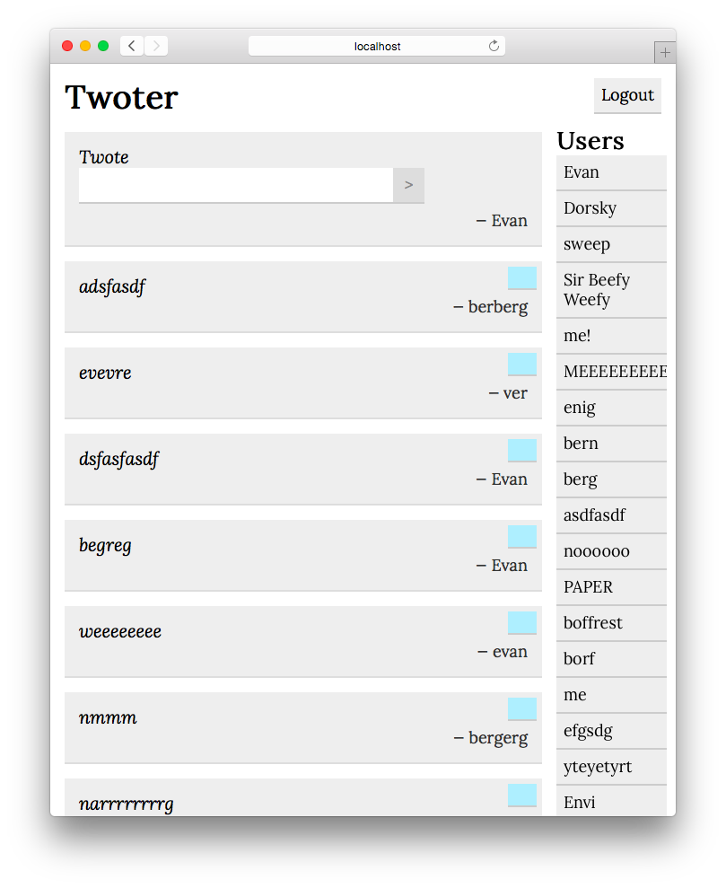

# Exercise 6

## Assignment

You're going to make Twitter! Not quite. But we're going to get closer than you think.

We're going to be a little more open-ended here, describing functionality and user experience rather than specific http endpoints.

### Requirements

A "twote" is a small piece of text written by a user. You can call it whatever you want, but probably not "tweet" for copyright reasons...

- The main page displays:
	- A list of all twotes, with the most recent at the top
		- Each twote displays text and the author
	- A form to post a twote (**Disabled or not visible if user is not logged in**)
		- Including a display of the logged-in user
	- A list of all users
		- Clicking on a user highlights that user's twotes
	- A logout button

- The login page has:
	- A form to log in
		- There is zero authentication! Just enter a username to log in as that user — the user will be created if it doesn't exist. This is clearly not secure, but it'll let us play around with user/session management before we dive into the world of authentication and security starting next class.

- A logged in user can:
	- Post a twote (the twote will appear at the top of the list without a page refresh)
	- Delete their twotes (a user can only delete their own twotes and only when logged in)
	- Logout (with the logout button)

- All actions happen without a page refresh! (Except for redirecting to/from the Login page)

You're also going to make your clone look something like this:

Using CSS! Some big things you should emulate:

- The 2-column display of twotes and users
- Each twote appears on its own line
- Add styling to the form! Default forms are ugly
- Nice fonts (see [Google fonts](https://www.google.com/fonts))
- Try to follow principles from the reading

### Reading

Erik Kennedy (actually Olin '10) wrote a great article on UI design targeted at engineers.

#### Read [part 1](https://medium.com/@erikdkennedy/7-rules-for-creating-gorgeous-ui-part-1-559d4e805cda) and [part 2](https://medium.com/@erikdkennedy/7-rules-for-creating-gorgeous-ui-part-2-430de537ba96).

It's a great read with lots of tips based on lessons learned by the author after hours of practice and analysis. The Medium staff themselves call it "useful"! Read it and keep it as a reference as you design your website. Your sites should look better than the example. Have fun with it!

#### Recommended Reading

Erik also links to another article on [deliberate practice](http://calnewport.com/blog/2010/01/06/the-grandmaster-in-the-corner-office-what-the-study-of-chess-experts-teaches-us-about-building-a-remarkable-life/) as applied to technical fields. Why not read it, too?
